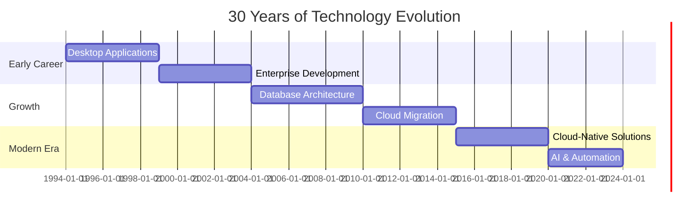

# 🚀 Advanced Profile Customization Ideas

This document provides advanced customization options to enhance your GitHub profile beyond the basics.

## 🎯 Profile Enhancements

### 1. **Pinned Repositories Section**

Create a custom "Featured Projects" section that highlights specific work:

```markdown
## 🌟 Featured Projects

<div align="center">

[](https://github.com/DenWin/repository-name)
[](https://github.com/DenWin/another-repo)

</div>
```

### 2. **Activity Timeline**

Add a visual representation of your recent activity:

```markdown
## 📈 Recent Activity

<!--START_SECTION:activity-->
<!--END_SECTION:activity-->
```

This requires setting up a GitHub Action (see workflow examples).

### 3. **Blog Posts Feed**

If you write technical blog posts, auto-display your latest posts:

```markdown
## 📝 Latest Blog Posts

<!-- BLOG-POST-LIST:START -->
<!-- BLOG-POST-LIST:END -->
```

This requires a GitHub Action that fetches from your blog RSS feed.

### 4. **Tech Stack Visualization**

Create a visual representation of your tech stack:

```markdown
## 🛠️ Technology Stack

### Backend
```text
SQL Server  ████████████████████░  95%
C#          ████████████████░░░░  80%
Java        ███████████████░░░░░  75%
```

### Cloud & Infrastructure
```text
Azure       ████████████████░░░░  80%
Terraform   ██████████████░░░░░░  70%
Docker      ███████████░░░░░░░░░  55%
```
```

### 5. **Animated Typing Effect**

Add dynamic typing animation for your tagline:

```markdown
[](https://git.io/typing-svg)
```

### 6. **Visitor Map**

Show where your profile visitors are from:

```markdown
## 🌍 Visitor Map


```

### 7. **Contribution Snake Animation**

Animated snake eating your GitHub contributions:

```markdown

```

Requires GitHub Action setup (see workflow examples).

### 8. **Spotify Now Playing**

If you want to share music (optional, more casual):

```markdown
[](https://open.spotify.com/user/youruserid)
```

## 📊 Advanced Statistics

### 1. **Detailed Language Stats**

```markdown
[](https://github.com/DenWin)
```

### 2. **Productive Time Stats**

```markdown
[](https://github.com/DenWin)
```

### 3. **Organization Stats**

If you contribute to organization repos:

```markdown
[](https://github.com/DenWin)
```

## 🎨 Custom Sections

### 1. **Case Studies / Portfolio**

```markdown
## 💼 Professional Highlights

### Enterprise Data Migration
**Challenge**: Migrate 10TB+ legacy database to Azure SQL
**Solution**: Designed and executed phased migration strategy with zero downtime
**Impact**: 40% performance improvement, 30% cost reduction

### Cloud Infrastructure Automation
**Challenge**: Manual deployment processes causing delays
**Solution**: Implemented Terraform-based IaC across 50+ environments
**Impact**: 80% reduction in deployment time, eliminated configuration drift

### AI-Powered Analytics
**Challenge**: Manual data analysis bottlenecks
**Solution**: Developed AI-powered automation framework
**Impact**: 5x faster insights, improved decision-making accuracy
```

### 2. **Skills Matrix**

```markdown
## 🎓 Skills & Expertise

| Category | Technologies | Experience Level |
|----------|-------------|------------------|
| **Databases** | SQL Server, T-SQL, Azure SQL | ⭐⭐⭐⭐⭐ Expert |
| **Backend** | C#, .NET, Java, Spring | ⭐⭐⭐⭐⭐ Expert |
| **Cloud** | Azure, IaC, Terraform | ⭐⭐⭐⭐☆ Advanced |
| **AI/ML** | Azure AI, Langchain, Automation | ⭐⭐⭐⭐☆ Advanced |
| **DevOps** | CI/CD, GitHub Actions, Azure DevOps | ⭐⭐⭐⭐☆ Advanced |
```

### 3. **Timeline of Experience**

```markdown
## 📅 Career Journey


```

### 4. **Certifications Showcase**

```markdown
## 🏅 Certifications & Achievements

<div align="center">

| Certification | Year | Issuer |
|--------------|------|--------|
| Azure Solutions Architect Expert | 2023 | Microsoft |
| Azure Developer Associate | 2022 | Microsoft |
| Oracle Database Administrator | 2015 | Oracle |
| Java Certified Professional | 2010 | Oracle |

</div>
```

### 5. **Speaking & Publications**

```markdown
## 🎤 Speaking & Thought Leadership

### Conference Talks
- **"30 Years of Database Evolution"** - TechConf 2023
- **"Infrastructure as Code at Scale"** - CloudSummit 2022
- **"Bridging Legacy to Modern"** - DevDays 2021

### Publications
- **"Best Practices for Azure SQL Migration"** - Tech Journal, 2023
- **"Terraform in Enterprise Environments"** - Cloud Magazine, 2022
```

### 6. **Open Source Contributions**

```markdown
## 🌟 Open Source Contributions

I believe in giving back to the community. Here are some projects I contribute to:

| Project | Role | Technologies |
|---------|------|-------------|
| [Project Name] | Contributor | SQL Server, C# |
| [Another Project] | Maintainer | Azure, IaC |
```

### 7. **Contact & Availability**

```markdown
## 📬 Get in Touch

<div align="center">

I'm always interested in discussing:
- 💡 Database architecture and optimization
- ☁️ Cloud migration strategies  
- 🤖 AI and automation solutions
- 🎓 Mentoring and knowledge sharing

**Available for:**
- Technical Consulting
- Architecture Reviews
- Speaking Engagements
- Mentorship

</div>
```

## 🎭 Profile Themes

### Professional Theme (Recommended for Corporate)
- Minimal badges
- Focus on expertise and experience
- Professional color scheme (blues, grays)
- Emphasize business value

### Technical Theme
- More technical badges
- Code snippets and examples
- Developer-focused language
- Show technical depth

### Community Theme
- Social badges
- Open source contributions
- Blog posts and articles
- Community involvement

## 🔧 Interactive Elements

### 1. **Collapsible Sections**

```markdown
<details>
<summary>📊 Detailed Statistics (Click to expand)</summary>

[Put detailed stats here that don't need to be visible by default]

</details>
```

### 2. **Quote/Callout Boxes**

```markdown
> 💡 **Professional Tip**: With 30 years in technology, I've learned that the best 
> solutions are often the simplest ones that solve real business problems.
```

### 3. **Emoji Headers with Purpose**

Use emojis strategically for visual navigation:
- 👨‍💻 About Me
- 🚀 Technical Skills
- 💼 Experience
- 🌱 Learning
- 📫 Contact

## 🎯 Profile Goals

Consider adding a section about your current focus:

```markdown
## 🎯 Current Focus (2024)

- 🔬 Exploring generative AI applications in enterprise software
- 📚 Deep-diving into Azure OpenAI Service
- 🌱 Contributing to open source database tools
- ✍️ Writing technical articles on database optimization
- 🎤 Preparing talks on AI-powered automation
```

## 📱 Mobile-Friendly Considerations

- Use responsive images
- Keep table widths reasonable
- Test on mobile GitHub app
- Avoid overly wide content

## 🔒 Privacy & Professional Boundaries

**Things to Consider:**
- Don't share employer-specific projects without permission
- Keep personal and professional separate if needed
- Be mindful of what activity is public
- Consider using GitHub private contributions for work projects

## 🎨 Color Schemes for Badges

Match badges to your professional brand:

**Professional Blue:**
```markdown
&color=0089D6
```

**Enterprise Gray:**
```markdown
&color=5C5C5C
```

**Success Green:**
```markdown
&color=28A745
```

## 📈 Metrics to Track

Consider adding metrics that matter:
- Years of experience: 30 Years badge
- Projects completed: Custom counter
- Technologies mastered: Visual list
- Certifications earned: Certification section

## 🚀 Advanced GitHub Actions Integration

See the `workflows/` directory for examples of:
- Auto-updating README with latest blog posts
- Contribution snake animation
- Dynamic stats updates
- Automated profile maintenance

## 💡 Final Tips

1. **Keep It Updated**: Review quarterly, update annually
2. **Be Authentic**: Let your personality shine through
3. **Stay Professional**: Remember this is visible to colleagues and recruiters
4. **Test Changes**: Preview before committing
5. **Get Feedback**: Ask colleagues for their impression
6. **Balance Detail**: Enough info without overwhelming
7. **Mobile Test**: Check on mobile devices
8. **Performance**: Don't embed too many heavy images

---

**Your Profile is Your Digital Business Card** 

With 30 years of experience, your profile should reflect:
- Depth of expertise
- Breadth of knowledge
- Professional maturity
- Continued passion for learning
- Value you bring to teams and projects

Make it count! 🚀
